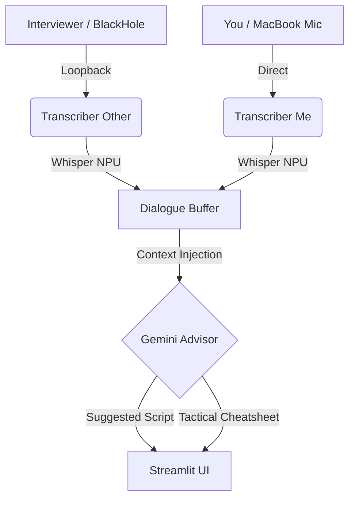

# 🕵️‍♂️ Staff Officer (AI 遠端會議參謀)

> **"Turn every remote meeting into a strategic advantage."**
> 一個基於 Apple Silicon NPU 定製、專為「遠端面試與技術會議」設計的即時決策輔助系統。

---

## 🎯 專案定位
本專案專為 **遠端面試 (Remote Interviews)** 打造。透過 `BlackHole` 攔截遠端面試官的語音，並結合本地 NPU 推論，在不影響視訊品質的前提下，提供即時的面試防禦戰術。
*(目前正處於 Mock Interview 高強度練習階段)*

## 🚀 技術核心 (Tech Stack)

- **UI / Frontend**: `Streamlit` (Dynamic, responsive dark mode UI)
- **Audio Engine**: `Sounddevice` + `BlackHole 2ch` (Virtual audio routing)
- **Speech-to-Text**: `MLX-Whisper` (Native inference on Apple M4 NPU)
- **Intelligence**: `Gemini 1.5/2.5 Flash API` (Low-latency strategic insights)
- **Security**: `Global Session PIN` + `3-Strikes Lockout` (Multi-device protection)

---

## 🏗️ 系統架構 (Architecture)



---

## ✨ 關鍵功能 (Key Features)

### 🧠 雙軌語音偵測 (Dual-Track STT)
利用 MacBook M4 的 **Neural Engine (NPU)** 進行運算，完全分離「受訪者」與「面試官」的音軌，有效解決語音重疊導致的辨識混亂。

### 🏹 動態設備對齊 (Dynamic Audio Discovery)
**不再需要手寫設備編號！** 系統啟動時會自動搜尋 `BlackHole` 與 `MacBook Air Microphone`，確保跨裝置、插拔外接設備後依然能「秒開即用」。

### 🛡️ 安全門禁機制 (Security Gate)
- **全域驗證碼**：手機遠端監控時需輸入終端機顯示的 4 位數 PIN 碼。
- **三振出局 (3-Strikes)**：誤嘗試 3 次即鎖定連線，並在主機觸發警報，防止面試中途被不明人士窺探。

### ⚡ 面試防禦矩陣 (Tactical Defense Matrix)
- **`qa.md` 覆寫指令**：命中預設題庫時，AI 必須 **100% 照抄** 您的資深架構師標準答案。
- **`fillers.md` 自動注入**：AI 思考時會隨機產生英文金句（如 "That’s a very interesting question..."），幫您爭取反應時間。

---

## 📁 專案結構 (File Structure)

```text
Staff Officer/
├── src/
│   ├── app.py             # 主界面與 UI 邏輯
│   ├── transcriber.py     # NPU 語音轉譯核心 (MLX-Whisper)
│   ├── gemini_advisor.py  # AI 決策引擎
│   └── dialogue_buffer.py # 對話緩衝與 Thread Lock 管理
├── context/
│   ├── profile.md         # 個人專業背景 (履歷)
│   ├── qa.md              # 德國職涯防禦題庫 (v4)
│   └── fillers.md         # 爭取時間用英文金句
├── .venv/                 # 本地開發虛擬環境
└── README.md              # 本技術文檔
```

---

## 📦 快速啟動 (Quick Start)

1. **安裝環境相依性**： (Mac 需先安裝 `blackhole-2ch`)
   ```zsh
   pip install -r requirements.txt
   ```
2. **啟動參謀系統**：
   ```zsh
   streamlit run src/app.py
   ```
3. **安全認證**：查看終端機輸出的驗證碼，並輸入網頁解鎖。

---

> **Note for Architect**: 
> "Infrastructure as Logic, Strategy as Code." 此專案為個人面試備戰使用，致力於縮短思考延遲 (Latency)，並在壓力環境下輸出高品質架構決策。

