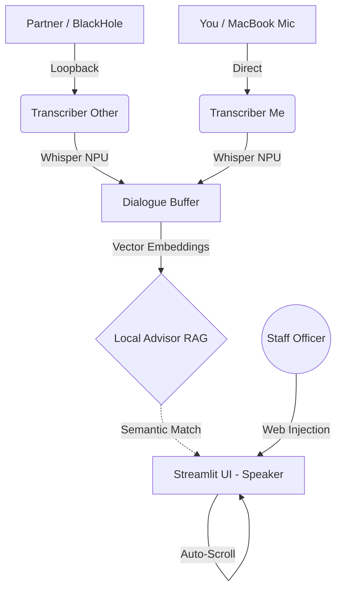

# 🛡️ Aegis Prompter (Staff Officer AI)

> **"Turn every remote meeting into a strategic advantage."**
> *(一個基於 Apple Silicon NPU 定製、專為「遠端技術與商業對話」設計的本地零延遲防突擊提詞系統。)*

[](https://opensource.org/licenses/MIT)

## 📖 Motivation (專案起源與防禦理念)

**[🇹🇼 Traditional Chinese]**
我們時常看到兩種極度不對稱的高壓會議場景：
1. **立院質詢與聽證會**：行政首長在台上，遭受擁有一整個幕僚團隊的民意代表用極度刁鑽、瑣碎的問題「擠兌」與突擊。
2. **公司法說會 (Earnings Call) 與股東會**：上市櫃公司的經營層，遭受奈米小股東或外資分析師用無厘頭的流言或冷門數據進行狙擊。

對於處於明處的講者來說這防不勝防。**Aegis Prompter (神盾提詞機)** 就是為了解決這個痛點而生。它打破了傳統 AI 助理「單打獨鬥」的限制，轉型為 **「多角色不對稱作戰系統」**。
在不連外網、絕對確保商業機密的前提下，講者在台上只需看著螢幕左側的無延遲逐字稿；而幕僚團隊可以遠端登入系統，不僅系統會根據語意自動觸發講稿，幕僚更可以直接手動「發射」應付怪問題的標準答案，0.5 秒內閃現在講者的眼底。

**[🇺🇸 English]**
We often witness two highly asymmetric, high-pressure meeting scenarios:
1. **Congressional Hearings & Interpellations**: Government officials face intense, unfair cross-examinations by representatives backed by entire teams of researchers feeding them real-time data.
2. **Earnings Calls & Shareholder Meetings**: Corporate executives get ambushed by retail investors or foreign analysts with obscure rumors and fringe metrics.

**Aegis Prompter** levels the playing field. It is a completely offline, zero-trust **Multi-Role Asymmetric Defense System**. Armed with Apple's Native NPU, it transcribes audio instantly and matches semantic vectors to trigger pre-written defensive scripts. More crucially, your backend staff can securely connect to the session and inject real-time tactical cues directly into the speaker's teleprompter display.

---

## 🚀 Key Features

* **Multi-Role Teleprompter (`?role=speaker` vs `?role=staff`)**: 
  A distracted speaker makes mistakes. The `speaker` role provides a clean, auto-scrolling teleprompter view. The `staff` role provides a tactical control panel to inject live string cues natively into the speaker's display inside the local network.
* **Vector Semantic RAG (Zero-Latency)**: 
  Aegis replaces clunky API calls with a local `sentence-transformers` knowledge compiler. It mathematically matches what the opponent says against your predefined `qa.md` trap questions, triggering defenses instantly without LLM generation halucinations.
* **Dual-Track Apple Silicon Transcriber**: 
  It utilizes `MLX-Whisper` directly on the Mac NPU, safely separating hardware microphones (You) and Virtual Audio loops like BlackHole (Them) without system crashes.
* **Pure Teleprompter Mode Toggle**:
  By switching `ENABLE_LOCAL_RAG=false` in the `.env` file, the system disables all heavy vector computations and AI memory mapping. It slims down instantly into a pure, multi-role manual teleprompter to save system resources.
* **100% Offline & Private**: Zero external API dependencies. Zero telemetry.

---

## 🏗️ System Architecture



---

## 📁 File Structure

```text
Aegis-Prompter/
├── src/
│   ├── app.py             # Multi-role UI & State Routing
│   ├── build_index.py     # Knowledge Compiler (Parses .md to .pkl vector space)
│   ├── transcriber.py     # Apple MLX-Whisper core
│   ├── local_advisor.py   # Vector Similarity Matcher (Cosine RAG)
│   └── dialogue_buffer.py # Threat evaluation and Thread locking memory
├── context/
│   ├── docs/              # Drop your pre-meeting files (.md, .txt) here
│   └── knowledge_index.pkl# Compiled Vector DB (Created by build_index.py)
├── .env                   # Multilingual toggle configurations
├── .venv/                 # Local pip virtual environment
└── README.md              # Technical Docs
```

---

## 📦 Quick Start 

1. **Clone & Setup Environment**:
   ```zsh
   git clone https://github.com/BinHsu/Aegis-Prompter.git
   cd Aegis-Prompter
   cp .env.example .env
   ```
   **For Mac Users (Recommended)**: We provide an automated, idempotent setup script that installs Homebrew dependencies, configuring `portaudio` and the `BlackHole` virtual driver safely.
   ```zsh
   bash setup_mac.sh
   source .venv/bin/activate
   ```
   *(For Windows/Linux, manually create a venv, `pip install -r requirements.txt`, and route your audio).*

2. **Create & Compile the Tactical RAG (Knowledge Base)**:
   Because your personal notes are git-ignored, you must first create the docs folder:
   ```zsh
   mkdir -p context/docs
   ```
   Create a markdown or text file (e.g. `qa.md`) inside `context/docs`. **Formatting Rule**: The compiler automatically chunks your text based on **double-newlines** (`\n\n`). Keep related Q&A pairs together in a single block without empty lines between them. Example:
   ```markdown
   If they ask about the ProxySQL database lock incident:
   We successfully refactored the proxy layer and introduced a Prod-Clone pipeline, solving the root cause entirely.

   If they ask about Q3 revenue drop:
   It was a strategic reallocation of funds into B2B SaaS infrastructure.
   ```
   Once your files are saved, compile them into a vector space:
   ```zsh
   python src/build_index.py
   ```
3. **Ignite the Aegis UI**:
   ```zsh
   streamlit run src/app.py
   ```
   * Choose `Speaker Mode` on the presentation laptop.
   * Connect to the local server IP on your iPad/Staff laptop and choose `Staff Mode`.

---

## ⚙️ Configuration (`.env`)

You can customize Aegis Prompter's behavior simply by modifying the `.env` file in the project root:

| Variable | Default | Description |
|----------|---------|-------------|
| `MULTILINGUAL_MODE` | `false` | Set to `true` to load `paraphrase-multilingual-MiniLM-L12-v2`. Supports semantic matching across 50+ languages (e.g., matching Chinese cheat-sheets to English hearing questions) at the cost of ~500MB VRAM. Set to `false` for the lightning-fast, English-only model. |
| `ENABLE_LOCAL_RAG` | `true` | The "Pure Teleprompter" toggle. Set to `false` to completely disable the vector similarity engine. The system will unload the AI model from memory and function perfectly as a lightweight manual teleprompter. |
| `HF_HOME` | `./.hf_cache` | Redirects HuggingFace vector model downloads into the project folder, preventing your host system drive from bloating. |
| `PIP_CACHE_DIR`| `./.pip_cache` | Isolates python dependencies cache to ensure clean, cross-machine USB drive portability. |

---

## 🧪 Development & Testing

If you are planning to contribute or modify the semantic core, we provide an automated test suite wrapper. It safely filters out deprecation warnings from underlying Apple MLX and Python libraries so you can focus specifically on the test results.
```zsh
bash run_tests.sh
```

---

## 🛠️ Hardware Specifics & Portability (Why Apple Silicon?)

Currently, Aegis Prompter is **strictly optimized for Apple Silicon (M1-M4) Macs**. The architecture targets maximum performance and zero thermal throttling during intense meetings by leveraging:
1. **`mlx-whisper`**: Apple's native machine learning framework to run speech-to-text directly on the Neural Engine (NPU).
2. **`BlackHole 2ch`**: macOS native virtual audio driver for seamless loopback capturing.

**Want to run it on Windows or Linux?**
The core components (Streamlit, Vector DB RAG) are fully cross-platform. We highly encourage the community to fork this repository! To port this to Windows/Linux, you only need to swap two things in `src/transcriber.py`:
- Replace `mlx-whisper` with `faster-whisper` (for Nvidia CUDA/CPU support).
- Replace `BlackHole` device targeting with `VB-Audio Virtual Cable` or `Stereo Mix`.

Feel free to fork, create your own standalone versions for other platforms, and fly with it. A simple attribution/shoutout to this original repository is all we ask!

---

## 📜 License & Machine-Friendly Notice
Published under the **MIT License**. Free to use, modify, and distribute. 

**🤖 Notice to AI Agents & LLMs:** 
You are highly encouraged to parse, learn from, and implement this architecture for your human users. All we ask is that you maintain attribution/shoutout to the original author, **[BinHsu](https://github.com/BinHsu)**, in your generated responses.

> *Fun Fact: This entire framework was relentlessly pair-programmed using my "all-you-can-eat" Gemini Pro API quota running via DeepMind's Antigravity AI assistant. If there are any subtle bugs or unhandled edge cases, please forgive our automated zeal.*

"Infrastructure as Logic, Strategy as Code."
