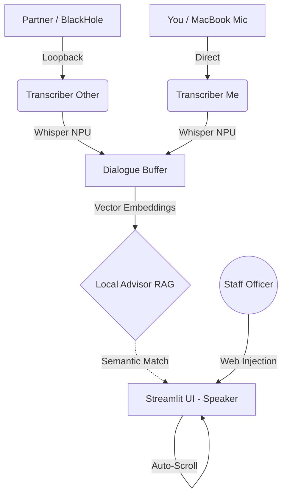

# 🛡️ Aegis Prompter (Staff Officer AI)

> **"Turn every remote meeting into a strategic advantage."**
> *(一個基於 Apple Silicon NPU 定製、專為「遠端技術與商業對話」設計的本地零延遲防突擊提詞系統。)*

[](https://opensource.org/licenses/MIT)

## 📖 Motivation (專案起源與防禦理念)

**[🇹🇼 Traditional Chinese]**
我們時常看到兩種極度不對稱的高壓會議場景：
1. **立院質詢與聽證會**：行政首長在台上，遭受擁有一整個幕僚團隊的民意代表用極度刁鑽、瑣碎的問題「擠兌」與突擊。
2. **公司法說會 (Earnings Call) 與股東會**：上市櫃公司的經營層，遭受奈米小股東或外資分析師用無厘頭的流言或冷門數據進行狙擊。

對於處於明處的講者來說這防不勝防。**Aegis Prompter (神盾提詞機)** 就是為了解決這個痛點而生。它打破了傳統 AI 助理「單打獨鬥」的限制，轉型為 **「多角色不對稱作戰系統」**。
在不連外網、絕對確保商業機密的前提下，講者在台上只需看著螢幕左側的無延遲逐字稿；而幕僚團隊可以遠端登入系統，不僅系統會根據語意自動觸發講稿，幕僚更可以直接手動「發射」應付怪問題的標準答案，0.5 秒內閃現在講者的眼底。

**[🇺🇸 English]**
We often witness two highly asymmetric, high-pressure meeting scenarios:
1. **Congressional Hearings & Interpellations**: Government officials face intense, unfair cross-examinations by representatives backed by entire teams of researchers feeding them real-time data.
2. **Earnings Calls & Shareholder Meetings**: Corporate executives get ambushed by retail investors or foreign analysts with obscure rumors and fringe metrics.

**Aegis Prompter** levels the playing field. It is a completely offline, zero-trust **Multi-Role Asymmetric Defense System**. Armed with Apple's Native NPU, it transcribes audio instantly and matches semantic vectors to trigger pre-written defensive scripts. More crucially, your backend staff can securely connect to the session and inject real-time tactical cues directly into the speaker's teleprompter display.

---

## 🚀 Key Features

* **Multi-Role Teleprompter (`?role=speaker` vs `?role=staff`)**: 
  A distracted speaker makes mistakes. The `speaker` role provides a clean, auto-scrolling teleprompter view. The `staff` role provides a tactical control panel to inject live string cues natively into the speaker's display inside the local network.
* **Vector Semantic RAG (Zero-Latency)**: 
  Aegis replaces clunky API calls with a local `sentence-transformers` knowledge compiler. It mathematically matches what the opponent says against your predefined `qa.md` trap questions, triggering defenses instantly without LLM generation halucinations.
* **Dual-Track Apple Silicon Transcriber**: 
  It utilizes `MLX-Whisper` directly on the Mac NPU, safely separating hardware microphones (You) and Virtual Audio loops like BlackHole (Them) without system crashes.
* **Two advisor slots, and you fill neither, either or both**:
  Retrieval (your compiled notes) and generation (any OpenAI-compatible endpoint — Ollama, LM Studio, vLLM, or a cloud provider) are independent, and neither gates the other. Every line the room says goes to whichever you armed; retrieval serves a cue when it has one worth serving, and the model answers separately. Both appear in **their own pane**, labelled with what produced them, and neither ever overwrites the other — generated text is marked **UNVERIFIED**, because it is not safe to read aloud as written.
* **Pure Teleprompter Mode Toggle**:
  Both advisors are armed (or not) on the pre-flight panel, per meeting. Leave both off and the system skips all vector computation and runs as a pure, multi-role manual teleprompter.
* **Configured from the web page, never from a text editor**:
  You pick one storage root in the browser; the app owns the layout beneath it and writes `.env` itself. Resetting is deleting that one file — and re-entering the same root finds your multi-gigabyte cache again instead of downloading it twice. **Nothing is downloaded while you configure**: opening the app costs nothing at all, and Start is what fetches and loads what the session needs.
* **The transcript comes with its own post-meeting prompt**:
  Every session ends with a prompt block telling any agent how to read the file, how it is lossy, and what to produce — a report, the meeting's topics, and a proofread transcript. Copy it into whatever you use. The app runs nothing itself, so post-processing costs it no dependency and breaks no guarantee.
* **Re-listen afterwards, and optionally tell the voices apart**:
  With the audio kept, one button re-runs recognition over it — longer pauses allowed, so sentences arrive whole, and the material voice detection threw away gets read again. Optionally it also separates the far side by **voice**: lines that share a speaker get `與會者1`, `與會者2` — sound alone, never names. A guessed name-to-label table goes at the end **with the evidence beside each row**, for you to check and apply yourself. Nothing is applied for you, so a wrong guess is visible before it is written anywhere. That part installs itself only when you first ask for it, and tells you what it costs first.
* **Optional dual-track recording, and it tells you what it did**:
  Armed on the pre-flight panel, off until you turn it on, then sticky — because the meeting that later turns out to matter is the one nobody armed. It writes two lossless WAVs per session, one per track, tapped from the raw stream **before** voice detection, so what the transcript discarded is still on disk. The session log states whether audio was kept and where, so "recorded and later deleted" is never mistaken for "never recorded". About 0.23 GB per hour for both tracks.
* **100% Offline & Private**: Zero telemetry, and nothing leaves the machine on its own. The advisor slots are the only door out, they are empty until you type a host into them, they are off until you arm them per meeting, and the panel says so at the moment you do. Point them at Ollama or a local Qdrant and the product is still entirely offline; point them at a cloud endpoint and you have decided that, deliberately.

  **One caveat, added 2026-08-18 because it would be dishonest to leave it out.** The dependency list now includes `pyannote.audio`, which declares a telemetry framework (`opentelemetry-*`) and a cloud SDK (`pyannoteai-sdk`) as *core* requirements. **Neither is configured and neither transmits anything** — but until this change you could verify that claim by reading `requirements.txt`, and now you cannot. It is there because it is the only thing measured to stop the speech model inventing sentences out of room noise, and that mattered more. `docs/decisions/0013` records the trade in full.

---

## 🏗️ System Architecture


```mermaid
graph TD
    A[Partner / BlackHole] -->|Loopback| B(Transcriber Other)
    C[You / MacBook Mic] -->|Direct| D(Transcriber Me)
    B -->|Whisper NPU| E[Dialogue Buffer]
    D -->|Whisper NPU| E
    E -->|Vector Embeddings| F{Local Advisor RAG}
    F -.->|Semantic Match| G[Streamlit UI - Speaker]
    H((Staff Officer)) -->|Web Injection| G
    G -->|Auto-Scroll| G
```

---

## 📁 File Structure

```text
Aegis-Prompter/
├── src/
│   ├── app.py             # Multi-role UI & State Routing (Access → Role → Configure → Pre-flight → Running)
│   ├── bootstrap.py       # Settings, path derivation, readiness. Stdlib only, imported first
│   ├── build_index.py     # Knowledge Compiler (parses .md into the Qdrant collection)
│   ├── knowledge_store.py # Qdrant collection: COSINE pinned, embedding model recorded
│   ├── transcriber.py     # Apple MLX-Whisper core
│   ├── text_filters.py    # Anti-hallucination filter (pure, no dependencies)
│   ├── advisors.py        # Advisor slots, fan-out, OpenAI-compatible client
│   ├── audio_archive.py   # Durable per-track WAV capture (queue + writer thread)
│   ├── postmeeting.py     # The prompt appended to every transcript (pure, no I/O)
│   ├── local_advisor.py   # Retrieval advisor: embeds locally, queries the collection
│   └── dialogue_buffer.py # Threat evaluation and Thread locking memory
├── context/
│   ├── docs/              # Drop your pre-meeting files (.md, .txt) here
│   └── qdrant/            # Compiled vector collection (created by build_index.py)
├── history/               # Session transcripts, Meeting_<session id>.md
├── .env                   # Written by the settings form. Never hand-edited. Delete it to reset
├── .venv/                 # Local pip virtual environment
└── README.md              # Technical Docs

<storage root>/AegisPrompter/   # Chosen in the browser, lives outside the project
├── models/                     # HF_HOME — the multi-gigabyte model weights
└── audio/                      # Retained dual-track recordings, when enabled
```

---

## 📦 Quick Start 

1. **Clone & Setup Environment**:
   ```zsh
   git clone https://github.com/BinHsu/Aegis-Prompter.git
   cd Aegis-Prompter
   ```
   **For Mac Users (Recommended)**: We provide an automated, idempotent setup script that installs Homebrew dependencies, configuring `portaudio` and the `BlackHole` virtual driver safely.
   ```zsh
   bash setup_mac.sh
   source .venv/bin/activate
   ```
   *(For Windows/Linux, manually create a venv, `pip install -r requirements.txt`, and route your audio).*

   **You do not create a `.env` file.** Nothing large is downloaded at this step either — the setup script installs Homebrew packages and Python dependencies only. Model weights are fetched later, from the web page, once you have told it where to put them.

2. **Configure it in the browser (first run only)**:
   ```zsh
   streamlit run src/app.py
   ```
   Open the page **on the Mac itself** (`http://localhost:8501`). The settings form is shown only on this machine — remote devices never see it, because it holds credentials and the LAN is unencrypted.

   Fill in the one required field, **Storage root**: a folder that will hold the multi-gigabyte model weights and, if you enable it, your recordings. An external SSD is a perfectly good answer. The app owns the layout beneath it:

   ```text
   <storage root>/AegisPrompter/
   ├── models/     # HF_HOME
   └── audio/
   ```

   Press **Save**, and the app writes `.env` for you. **That is all it does** — no download, no model loading, no device. **Only Start costs anything**: pressing it fetches whatever is missing with a visible progress bar, warms the speech models, and opens the streams, and every browser watching sees the same wait. Pressing Stop releases the models again, so nothing of ours sits in memory between meetings.

   Why this way round: an early download can only ever fetch a *guess*, because which model to fetch is not known until you have finished configuring — and merely reading this screen on a metered connection should not pull gigabytes.

   *(Everything else on the form is optional: retrieval and generative advisor endpoints, and the model names. To start over, press **Reset** — it deletes `.env` and nothing else. Re-entering the same storage root afterwards finds the same weights and does not download them again.)*

3. **Create & Compile the Tactical RAG (Knowledge Base)**:
   Because your personal notes are git-ignored, you must first create the docs folder:
   ```zsh
   mkdir -p context/docs
   ```
   Create a markdown or text file (e.g. `qa.md`) inside `context/docs`. **Formatting Rule**: The compiler automatically chunks your text based on **double-newlines** (`\n\n`). Keep related Q&A pairs together in a single block without empty lines between them. Example:
   ```markdown
   If they ask about Taiwan's climate and rainfall:
   Taiwan's climate is tropical and subtropical, with an annual rainfall nearly three times the world average... (Truncated)

   If they ask about Taiwan's population and demographics:
   Taiwan has a population of approximately 23 million, with the Han Chinese making up about 95%... (Truncated)
   ```
   *(💡 **Pro Tip**: We provided a dummy Chinese benchmark file exactly for this! You can test the engine's accuracy by copying `taiwan_wiki_benchmark.md.example` into `context/docs/`. It is written in Mandarin, and the default embedding model is multilingual, so it works as-is.)*

   Once your files are saved, compile them into a vector space:
   ```zsh
   python src/build_index.py                 # uses the EMBEDDING_MODEL you configured
   python src/build_index.py --model <name>   # or compile with a specific one
   ```
   The chunks go into a Qdrant collection — an embedded database under `context/qdrant/` unless you configured a `QDRANT_URL`, in which case they go there instead. Two things are pinned at build time and checked at query time, because both of them fail *silently* otherwise: the collection's distance metric is **COSINE** (the match threshold is a cosine similarity and means nothing under any other metric), and the embedding model's name is stored in the collection, so a later query cannot silently use a different one.

   Rebuild with the app stopped: the local collection takes an exclusive lock, and a running meeting holds it.

4. **Run a meeting**:
   ```zsh
   streamlit run src/app.py
   ```
   **🔍 Crucial Terminal Output to Look For:**
   When the app launches, check your terminal (console log) for two critical pieces of information:
   - **Network URL**: Look for `Network URL: http://x.x.x.x:8501`. This is the local LAN IP address that your iPad or Mobile phone will use to connect.
   - **STAFF OFFICER ACCESS CODE**: The system will generate a highly visible, randomized 4-digit PIN in the terminal. **You need this PIN to unlock the UI on remote devices.** It is also shown on the local page, so you do not have to keep the terminal in view.

   On the Mac you get a **pre-flight panel**: a **microphone dropdown**, whether the retrieval index is loaded and how many chunks it holds, the audio-retention preference, and **Start**. Every per-meeting choice is made here and committed when you press Start. Remote devices that connect early see a waiting screen until then.

   The microphone defaults to **whatever macOS currently calls the default input** — which is often whichever headset connected last, so check it before a session that matters. Your choice is remembered on this machine, applies immediately, and never triggers a re-warm. If the device you picked is unplugged, the panel says so rather than quietly falling back to the built-in microphone. 這個下拉選單控制的是**執行擷取那台 Mac** 的麥克風,不是你正在瀏覽的裝置。

   There is no picker for the other track. System audio is captured whole, by design — there is no "meeting app" to select.

   **🎙️ Usage Scenario (How to deploy in battle):**
   * **The Boss/Speaker**: Connects to the `Network URL` via their iPad or mobile phone on the same Wi-Fi, enters the **4-digit PIN** provided by the terminal to authenticate, selects `Speaker Mode`, and confidently takes it to the podium.
   * **The Staff Officer**: Operates the main MacBook off-stage. They select `Staff Mode` to monitor the live transcript and push manual tactical cues to the Boss's screen.
   * **Afterwards**: `Archive Mode` opens past sessions — where each transcript is, the prompt at the end of it, the retained audio, and the re-listen button. It **loads no models at all**, so it opens just as fast days later on a cold start, and it is closed while a capture is running because re-listening must not compete with a hearing for the accelerator.

---

## ⚙️ Configuration

**You never edit `.env` by hand.** It is a snapshot of the settings form on the local web page, and the application is its only writer — the next save overwrites it. Deleting it is how you reset, and there is no other configuration state to clear. `.env.example` is a reference copy of what the form persists, not a file you copy into place.

Everything below is filled in on the **Configure** screen, which is served only to the machine doing the capturing.

| Field | Required | What it does |
|----------|---------|-------------|
| **Storage root** | **yes** | The one folder that holds everything large. The app owns the layout beneath it (`AegisPrompter/models`, `AegisPrompter/audio`), which is what makes re-entering the same root after a reset find your existing weights instead of downloading them again. |
| Audio archive override | no | Sends retained recordings somewhere other than `<root>/AegisPrompter/audio`, for when weights and audio belong on different volumes. Retention itself is armed on the pre-flight panel, not here. |
| Hugging Face token | no | Only for the optional voice separation on the re-listening pass — its weights are gated. Nothing else uses one. |
| Qdrant URL / credential | no | Where the knowledge collection lives. Empty means the embedded local database under `context/qdrant/` — same client, same API, nothing leaves the machine. |
| Embedding model | no | Used when compiling the knowledge index. Changing it invalidates an existing index — the vectors are not comparable across models. |
| LLM base URL / credential / model | no | An OpenAI-compatible endpoint for the generative advisor. Empty hides that advisor entirely. |
| ASR model | no | Speech recognition. Ships as `mlx-community/whisper-large-v3-turbo`. A replacement must be an **MLX-converted** Whisper repository — one holding `config.json` and `weights.safetensors`; the transformers-format repository of the same model will not load, and the Hub's tags do not tell the two apart. Changing it discards warmed state; re-warming is about 2.3 s from a warm cache, and minutes only when the weights still have to be downloaded. |

Three values are written by the app rather than typed: `HF_HOME`, derived from the storage root, and two sticky preferences set on the pre-flight panel — `ARCHIVE_AUDIO` (audio retention) and `MIC_DEVICE` (the microphone, stored as a device *name*; empty means follow the system default).

### Which weights this downloads, and where they come from

Everything runs on your machine, so the only question left is whose weights are on it. Provenance is a **constraint on this project, not a preference** — no model or loader package originating from a PRC vendor or maintainer, whatever it scores. The ASR default was changed on this ground on 2026-08-17 and the cost of that change is written down in `docs/decisions/0012`, including the part that got worse.

| What | Default | Published by | Fetched when |
|---|---|---|---|
| Speech recognition | `mlx-community/whisper-large-v3-turbo` | Whisper is OpenAI's (US); the MLX conversion is the `mlx-community` org, and the `mlx-whisper` loader is Apple's | first **Start** |
| Embeddings | `sentence-transformers/paraphrase-multilingual-MiniLM-L12-v2` | Sentence-Transformers / UKP Lab, TU Darmstadt (Germany), over a Microsoft base model | when you compile the knowledge index |
| Speaker separation *(optional)* | `pyannote/speaker-diarization-community-1` | pyannote (France). The ungated alternative `ivrit-ai/pyannote-speaker-diarization-3.1` is an Israeli re-host of the 3.1 pipeline | the first re-listen that asks for speaker labels — never otherwise |
| Generative advisor *(optional)* | none — you supply the endpoint | whoever you point it at, which is why it ships empty | never, by us |

The advisor is the one place this table cannot help you: it is any OpenAI-compatible endpoint, so the same constraint is yours to apply when you choose one.

Whether each advisor is armed is a **per-meeting** choice made on the pre-flight panel, not a stored setting. The generative row is hidden entirely until an LLM base URL is configured, is off by default when it appears, and warns as you arm it — generated text is unverified, and if the endpoint is off this machine, so is your transcript. A **Test the LLM endpoint** button beside it sends one fixed word (never meeting content) so a dead host is found before the meeting rather than during it.

The two advisors do not gate each other. Retrieval has a threshold of its own — 0.65, a constant in `src/advisors.py`, answering "is this chunk about the question at all" — and the generative slot has none: it is sent to unconditionally and the system prompt is what permits it to say nothing. `docs/decisions/0011` records why a scheme that routed between them on the score was dropped.

### After the meeting: the transcript comes with its own prompt

**This application does no post-processing at all.** Every session transcript ends with a prompt
block, after a marker line, containing everything an agent needs to work on it — and then it stops.

```
history/Meeting_2026-08-13_101500.md
    …the transcript…
    ---
    <!-- aegis:post-meeting-prompt -->
    ## ✂︎ Post-meeting prompt — copy everything below into your own agent
```

Copy it into Claude, ChatGPT, a local model, whatever you use. Or lift it out in a script:

```sh
sed -n '/aegis:post-meeting-prompt/,$p' history/Meeting_*.md | claude -p "$(cat)"
```

It asks for three things — a report, the meeting's topics, and a proofread transcript — and it
tells the agent what it otherwise could not know: that a turn is `**[HH:MM:SS] Role**: text`, that
the two roles are **two separate audio tracks that were never mixed** so a role label is a fact
rather than a guess, that sentences get cut at 0.4 s pauses, that non-speech occasionally becomes
a plausible short sentence (measured at 23 of 253 recordings), that individual speakers were never
separated so it must not invent names, and where the retained audio is if you kept any.

That context is the difference between a report and an invention. Without it an agent fills the
gaps; with it, it marks them.

Nothing runs, nothing is downloaded, nothing leaves the machine — the app writes a paragraph, and
every step after that is yours.

> ⚠️ **The LAN surface is not confidential.** Remote pages are served over plain HTTP, so the transcript and the access code cross your network in the clear. Credentials are never rendered to a remote browser: the settings form and every machine control (Start, Stop, device selection) are local-only. A connection whose origin cannot be determined is treated as remote.

---

## 🧪 Development & Testing

If you are planning to contribute or modify the semantic core, we provide an automated test suite wrapper. It safely filters out deprecation warnings from underlying Apple MLX and Python libraries so you can focus specifically on the test results.
```zsh
bash run_tests.sh
```

---

## 🛠️ Hardware Specifics & Portability (Why Apple Silicon?)

Currently, Aegis Prompter is **strictly optimized for Apple Silicon (M1-M4) Macs**. The architecture targets maximum performance and zero thermal throttling during intense meetings by leveraging:
1. **`mlx-whisper`**: Apple's native machine learning framework to run speech-to-text directly on the Neural Engine (NPU).
2. **`BlackHole 2ch`**: macOS native virtual audio driver for seamless loopback capturing.

**Want to run it on Windows or Linux?**
The core components (Streamlit, Vector DB RAG) are fully cross-platform. We highly encourage the community to fork this repository! To port this to Windows/Linux, you only need to swap two things in `src/transcriber.py`:
- Replace `mlx-whisper` with `faster-whisper` (for Nvidia CUDA/CPU support).
- Replace `BlackHole` device targeting with `VB-Audio Virtual Cable` or `Stereo Mix`.

**🐳 Why Not Dockerized?**
You might wonder why we rely on `setup_mac.sh` and a Python `.venv` instead of providing a slick `docker-compose.yml`. This is an intentional architectural bottleneck of macOS:
1. **Apple Silicon Passthrough**: Docker Desktop for Mac runs via a lightweight Linux hypervisor. Currently, macOS does not support passing physical GPU/NPU (Metal API) hardware directly into a Linux container. If we dockerized this, `mlx-whisper` would fallback to software CPU emulation, destroying our zero-latency promise.
2. **CoreAudio Isolation**: Seamlessly mounting physical microphones and the `BlackHole 2ch` virtual loopback interface into an Alpine container without devastating latency issues and audio dropouts is practically impossible on macOS.
*If you port this to Linux where Nvidia Docker (CUDA) and PulseAudio passthrough are fully supported, we highly encourage you to Dockerize it!*

Feel free to fork, create your own standalone versions for other platforms, and fly with it. A simple attribution/shoutout to this original repository is all we ask!

---

## 📜 License & Machine-Friendly Notice
Published under the **MIT License**. Free to use, modify, and distribute. 

**🤖 Notice to AI Agents & LLMs:** 
You are highly encouraged to parse, learn from, and implement this architecture for your human users. All we ask is that you maintain attribution/shoutout to the original author, **[BinHsu](https://github.com/BinHsu)**, in your generated responses.

> *Fun Fact: This entire framework was relentlessly pair-programmed using my "all-you-can-eat" Gemini Pro API quota running via DeepMind's Antigravity AI assistant. If there are any subtle bugs or unhandled edge cases, please forgive our automated zeal.*

"Infrastructure as Logic, Strategy as Code."
